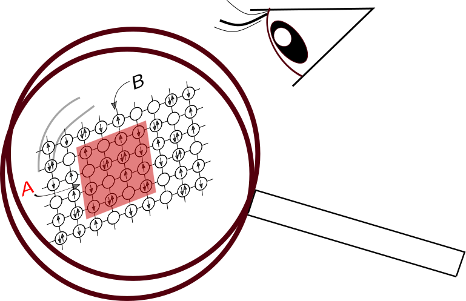

# Generating fermionic pseudo-snapshots


This repository contains subroutines for nested componentwise direct sampling (NCDS) of
occupation number states from pseudo free-fermion density matrices 
as they arise naturally in finite-temperature determinantal QMC (DQMC) simulations.

The code can be used in two forms, either 
1. as a stand-alone code, which uses as input the Green's functions which have been output and written 
   on disk during a previous DQMC run or 
2. directly called from a DQMC code so that fermionic snapshots are output "on the fly".    

The two use cases are descibed in the following.

Reading Green's function from a previous DQMC run:
--------------------------------------------------

`simparams.in`
```
filename = 'list_of_sitearrays.txt'   ! Here, a subset of sites for sampling can be selected (currently not used)
Nsites = 100                          ! Total number of sites 
max_HS_samples = 10                   ! Read a maximum number of Green's functions from the files Green_ncpuXXXXX_up(dn).dat  
Nsamples_per_HS = 5                   ! Generate `Nsamples_per_HS` number of occupation number snapshots per Green's function                   
skip = 0                              ! Discard the first `skip` number of Green's function 

```

The equal-time Green's function in real space for spin up and spin down is assumed to be stored in 
the files `Green_ncpu00000_up.dat` and `Green_ncpu00000_dn.dat`. The two files contain a stream 
of Green's function matrices for spin up and spin down in a synchronized fashion, i.e. the n-th 
Green's function in the "up-file" must be combined with the n-th Green's function in the "down-file". 
Successive Green's functions are separated by two empty lines.
The five-digit number code labels DQMC output from different CPUs, parallelized via MPI, and 
the code for sampling of fermionic pseudosnapshots can be run with the same number of CPUs
by calling 
```
mpiexec.openmpi -np 1 ./sample_pseudo_DM
```


Interfacing with the QUantum Electron Simulation Toolbox (QUEST) DQMC code:
----------------------------------------------------------------------------

From the open-source QUEST determinantal QMC code (-> http://quest.ucdavis.edu/index.html) 
the provided driver subroutine could be called like 
so in the subroutine `DQMC_Phy0_Meas`:


    call run_sample_pseudo_DM(G_up=G_up, G_dn=G_dn, BSS_sign_up=sgnup, BSS_sign_dn=sgndn,  sp_basis="real_space", &
           Nsamples_per_HS=20, outfile_basename="Fock_samples", &
           MPI_rank=qmc_sim%rank )


Then it will write the snapshots for spin-up and spin-down in two "synchronized" files together
with the sign and reweighting factor. Further documentation can be found in the source code itself.

If you use this code, please cite:
----------------------------------
```
@article{arXiv:2009.07377,
      title={Numerically exact quantum gas microscopy for interacting lattice fermions}, 
      author={Stephan Humeniuk and Yuan Wan},
      year={2020},
      eprint={2009.07377},
      archivePrefix={arXiv},
      primaryClass={cond-mat.quant-gas}
}
```


